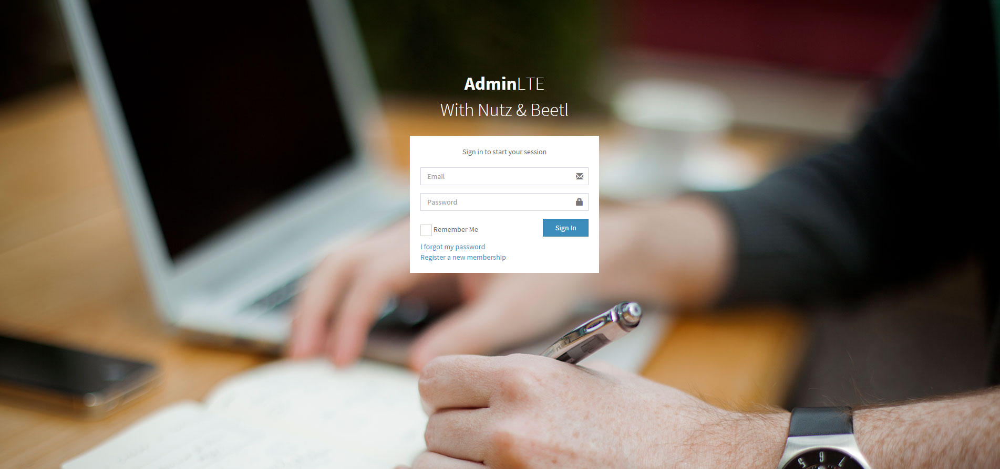
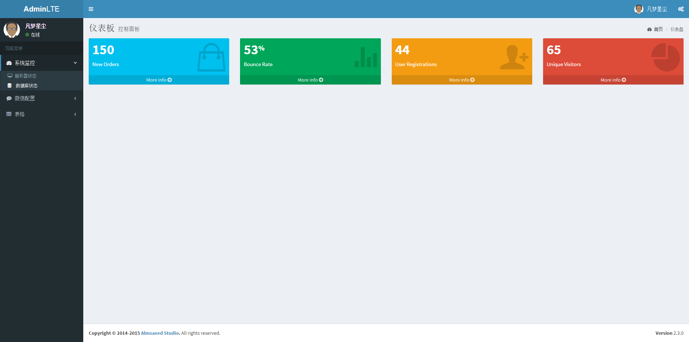
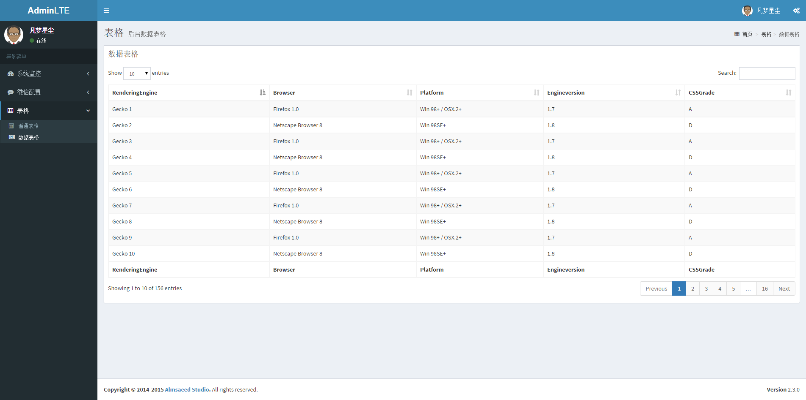

# Nutz-Beetl-AdminLTE2

`Bootstrap` 是当前流行的前端开发框架,各式各样的主题也是琳琅满目,目不暇接.最后对比下来还是选择了`AdminLTE` [点击预览](https://almsaeedstudio.com/preview) 然后结合`Beetl` 模板引擎,搭载`Nutz`后端框架,共同构建一个管理系统模板,感觉兴趣的童鞋可以关注或加入,后续再慢慢更新吧.

截图预览:

1. 登录界面

[点击预览](http://alte2.oschina.mopaas.com/login.html)

2. 主界面

[点击预览](http://alte2.oschina.mopaas.com/admin/index.ntz)

3. 数据表格界面

[点击预览](http://alte2.oschina.mopaas.com/admin/table/datagrid.ntz)